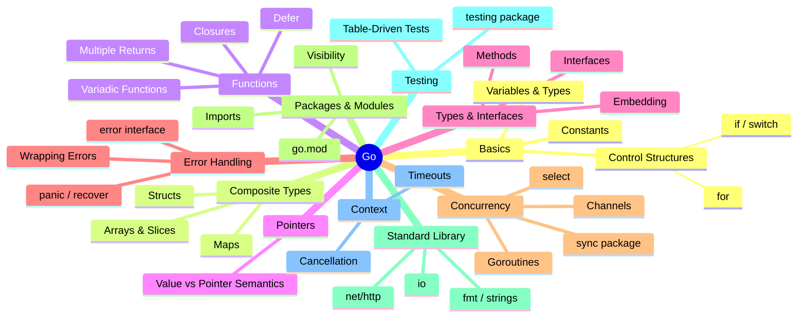

**# 🐹 go-playgorund

Learning Go with **"Learning Go" by Jon Bodner (O'Reilly)** — notes, chapter exercises, and projects along the way.

---

## 🧠 Go Mind Map



---

## 📂 Structure

```
go-playgorund/
├── chapters/     # code & notes per book chapter
├── projects/     # small projects built while learning
└── go.mod
```

---

## 📚 Reference

Book: *Learning Go, 2nd Edition* — Jon Bodner (O'Reilly)**
